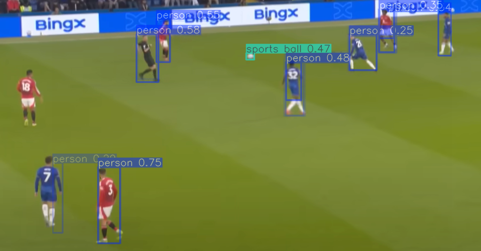

# YOLOv8 Screen Detection Overlay

This Python project creates a transparent and draggable window that captures part of the screen and runs real-time object detection using YOLOv8. It includes a control panel to pause, resume, or exit the detection.

## 🖼️ Preview



## 🚀 Features

- Real-time screen detection using YOLOv8
- Transparent overlay window with draggable functionality
- Separate control panel window for pause/resume and exit
- Uses `mss` for screen capture and `PIL`/`cv2` for frame rendering

## 🧰 Requirements

```bash
pip install ultralytics opencv-python pillow mss
```

## ▶️ How to Run

1. Place `yolov8n.pt` model file in the project folder.
2. Run the script:

```bash
python main.py
```

## 📂 Files

- `main.py` — Application source code
- `yolov8n.pt` — YOLOv8 Nano model (download separately from Ultralytics)
- `example.png` — Example output image

## 🪟 Platform Support

- ✅ Windows (tested and supports transparency via ctypes)
- ⚠️ macOS/Linux support may require window layering adjustments

## 📄 License

MIT License
